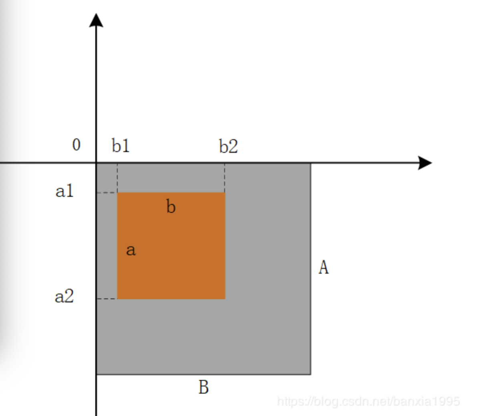

## python的第三方库

###Pillow库 - image模块

####crop()方法--图片裁剪操作
>使用PIL裁切图片使用PIL需要引用Image，使用Image的open(file)方法可以返回打开的图片，使用crop((x0,y0,x1,y1))方法可以对图片做裁切。
 
>区域由一个4元组定义，表示为坐标是 (left, upper, right, lower)，Python Imaging Library 使用左上角为 (0, 0)的坐标系统
 
>box(100,100,200,200)就表示在原始图像中以左上角为坐标原点，截取一个100*100（像素为单位）的图像，为方便理解，如下为示意图box（b1,a1,b2,a2）
 
 
 
>举个代码例子：
````
from PIL import Image

im=Image.open("error.jpg")
box=(100,100,100,100)
img=im.crop(box)img.save("error1.jpg")
#box=(100,100,400,400)
#首先，一张图片的左上角坐标为(0,0)，
#然后，从坐标为(100,100)的点到坐标为(400,400)的点连成一条斜线，
#最后，这个box即是以这条斜线为对角线的矩形
````

###验证码图片识别

>第三方图片识别ShowapiRequest（付费）